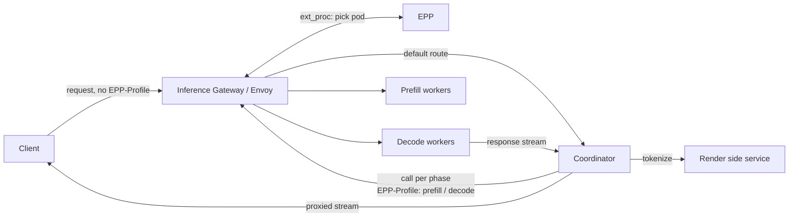
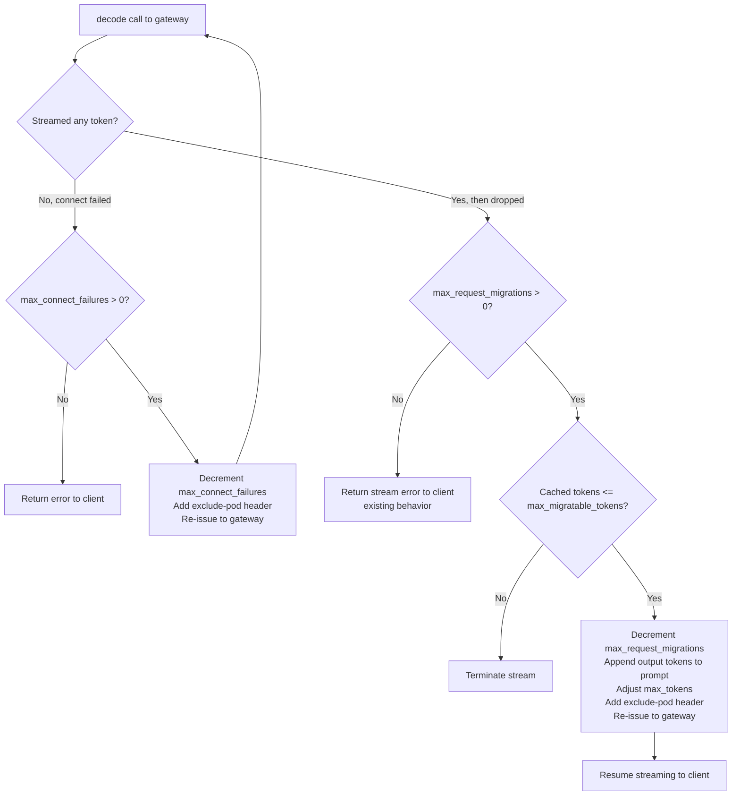
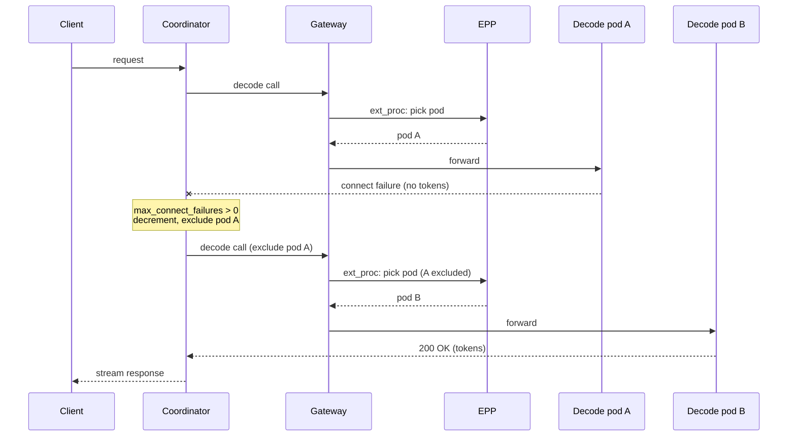
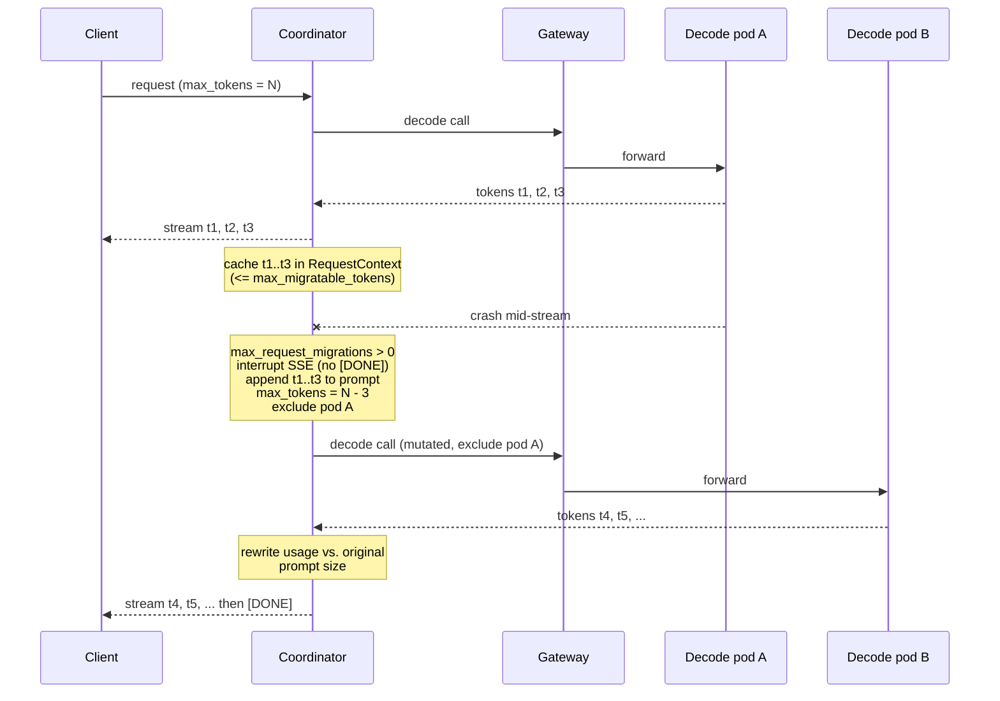
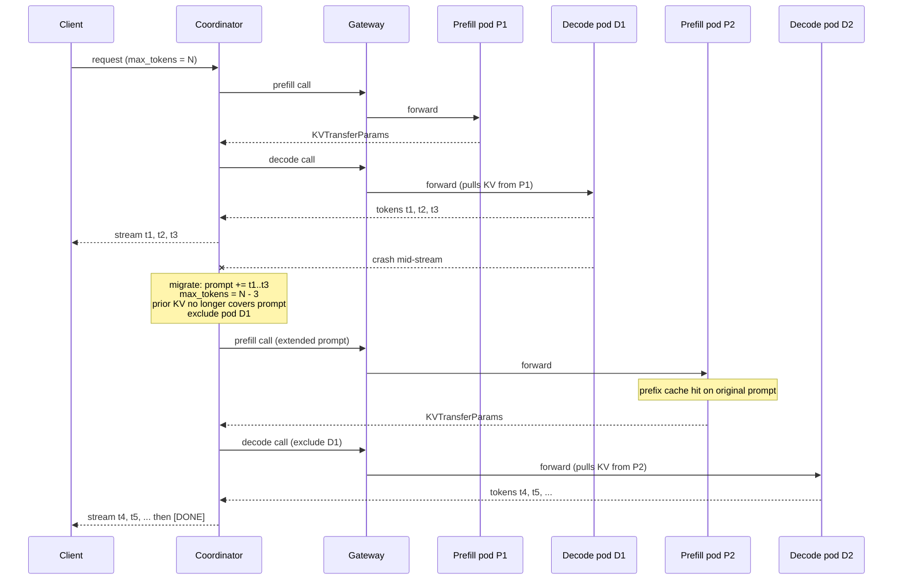

# Active Request Migration

Active request migration lets an in-flight inference request survive a worker (model
server) failure without the client noticing. When a decode worker fails to connect or
drops mid-stream, the coordinator re-issues the request to a different worker and resumes
streaming, so the client sees one uninterrupted response.

This document covers **Phase 1: `/v1/completions` and `/v1/chat/completions`**.

## Goals

- No interruption to the client when a request is migrated: one connection, one response
  stream, one request ID.
- Generated output is not lost: tokens already produced are carried into the retry.
- Migration is configurable per failure class (connect failure, mid-stream disconnect,
  worker crash), including disabling it entirely.

## Failure model

A request is migrated when a decode worker fails after the coordinator has committed to
it. Two failure points are distinguished:

| Failure point | Symptom | Client impact without migration |
| :---- | :---- | :---- |
| Connect failure | The decode call fails to connect or returns before any token is streamed. | Request error. |
| Mid-stream disconnect | The worker crashes or the connection drops after partial output has been streamed. | Truncated response, stream error. |

The mitigation for a mid-stream disconnect rests on one property of the OpenAI
completion endpoints: **the request is stateless, and prompt tokens and generated tokens
are interchangeable when producing the next token.** Output tokens already streamed can
be appended to the prompt of a fresh request and generation continues on another worker
from the exact point the previous worker stopped (see
[Appendix: token-reuse example](#appendix-token-reuse-example)).

The migration steps for a mid-stream disconnect:

1. **Detect** the stream disconnection at the coordinator.
2. **Preserve state**: the request's token sequence now holds the original prompt tokens
   plus every token successfully generated by the failed worker.
3. **Create a new stream** carrying the accumulated state, so the new worker has the full
   context.
4. **Continue**: the new worker receives the full token context and resumes generation
   from where the previous worker left off.

## Why the coordinator

The coordinator sits as a reverse proxy behind the Inference Gateway (Envoy). The gateway
forwards a client request to the coordinator when it carries no `EPP-Profile` header; the
coordinator then owns the lifecycle of that request. It tokenizes and optionally
disaggregates the request, then re-issues one call per phase back to the gateway with the
`EPP-Profile` header set so `ext_proc` routing picks prefill and decode pods via the EPP.
Prefill and decode responses return to the coordinator, which proxies them to the client.
The coordinator serves both disaggregated (prefill/decode) and aggregated (decode-only)
serving. See [coordinator_architecture.md](coordinator_architecture.md) for the full
picture.



The coordinator is the natural home for migration:

- It is already in the critical path when used, holding the client connection for the
  request's full lifetime.
- It has graduated out of incubation and lives in the llm-d-router repo, so supporting
  migration here is operationally simpler than a new component or Envoy changes.
- Because it reverse-proxies the entire request (unlike the EPP, which is an `ext_proc`
  backend), nearly all migration logic can be contained in the coordinator. The remaining
  change is in llm-d-router.
- Migrated requests still pass llm-d-router admission and flow-control: a new request
  stream re-enters the gateway and the EPP, and does not bypass scheduling.

## Solution overview

Migration is enabled and bounded on the `decode` step's `params`:

```yaml
log_level: 2
server:
  listen_addr: ":8080"
  read_timeout: 30s
  write_timeout: 120s
gateway:
  address: "http://inference-gateway:80"
  max_idle_conns_per_host: 100
  timeout: 60s
pipeline:
  use_openai_format: true
  steps:
    # 1. Tokenize the prompt via the render service (optional).
    - type: render
      params:
        address: "http://rendering-service:8080"
        timeout: 30s
    # 2. Combined prefill + decode (EPP-Profile: decode), sent to a single
    #    combined worker pod via the gateway / EPP.
    - type: decode
      params:
        enable_request_migration: true
        max_connect_failures: 3      # retries when the worker never streams a token
        max_request_migrations: 2    # retries after partial output has streamed
        max_migratable_tokens: 50000 # cap on prompt + output tokens cached for migration
```

| Param | Meaning |
| :---- | :---- |
| `enable_request_migration` | Master switch for failover and mid-stream migration on this step. |
| `max_connect_failures` | Maximum retries when the chosen worker never streams a token. `0` returns the error to the client. |
| `max_request_migrations` | Maximum mid-stream migrations after partial output has streamed. `0` preserves existing behavior: the stream error is returned to the client. |
| `max_migratable_tokens` | Maximum prompt + output tokens cached in the `RequestContext` for a possible migration. Exceeding it terminates the stream. `0` means no limit. |

## Decode stage behavior

The decode step branches on where the failure occurs.



### Connect failure

The decode call fails to connect or returns before any token streams.

1. If `max_connect_failures == 0`, return the error to the client.
2. Otherwise, the coordinator sets a header telling the EPP to exclude the failed backend
   pod from scheduling, and decrements `max_connect_failures`.
3. It sends a fresh request to the gateway endpoint.
4. On success it continues streaming the response to the client.



### Mid-stream migration

The worker crashes or the connection drops after partial output has streamed.

1. If `max_request_migrations == 0`, return the stream failure error to the client
   (existing behavior).
2. Otherwise, decrement `max_request_migrations` and:
   1. Interrupt the SSE chunks to the client (do not emit `[DONE]`).
   2. Record the original token input size and usage in the `RequestContext`.
   3. Mutate the request: append the already-generated output tokens to the input prompt
      and reduce `max_tokens` by the number of tokens already produced.
   4. Set the exclude-pod header for the failed backend and send the request back to the
      gateway.
   5. Intercept the new response chunks, correct the token usage against the original
      prompt size, and forward the chunks to the client.



### State and resource considerations

- There is no persistent state. Everything migration needs lives on the per-request
  `RequestContext` and is discarded when the request completes.
- Migration adds memory pressure: output tokens streamed to the client must also be
  cached in the `RequestContext` so they can be replayed into a retry.
- `max_migratable_tokens` bounds that cache (prompt + output tokens). When it is exceeded,
  the stream is terminated rather than migrated.
- Multiple output choices (`n > 1`) are not supported for request migration. Resumption
  appends the generated output tokens to the prompt of a single continuation, which has no
  meaning when the request produces several independent choices, each with its own token
  stream. A request with `n > 1` is served without migration.

### Metrics

Each coordinator emits metrics for the number of connection failures and the number of
request migrations.

## P/D disaggregation

The Phase 1 configuration above runs a combined prefill+decode worker: a single `decode`
call produces the whole response, so a migration re-issues that one call. Under P/D
disaggregation the coordinator instead makes a separate `prefill` call, which returns
`KVTransferParams` on the `RequestContext`, followed by a `decode` call whose pod pulls
the KV cache from the prefill pod (see
[coordinator_architecture.md](coordinator_architecture.md)). Migration must account for
that cross-phase KV dependency: a decode pod cannot serve a request unless the KV cache
for its prompt still exists somewhere it can pull from.

Encode disaggregation is out of scope for Phase 1, which covers text-only
`/v1/completions` and `/v1/chat/completions`.

Migration is enabled per phase. The prefill step gains a connect-failure retry; the
decode step keeps the full set of knobs:

```yaml
pipeline:
  steps:
    - type: render
      params:
        address: "http://rendering-service:8080"
    - type: prefill
      params:
        enable_request_migration: true
        max_connect_failures: 3      # prefill produces no client output, so only connect retries apply
    - type: decode
      params:
        enable_request_migration: true
        max_connect_failures: 3
        max_request_migrations: 2
        max_migratable_tokens: 50000
```

The three failure points are handled differently because they differ in what state has
been committed and what the client has already seen.

| Failure point | Client output so far | KV validity for the retry | Action |
| :---- | :---- | :---- | :---- |
| Prefill connect failure | None | N/A (KV not yet produced) | Retry prefill on another pod, excluding the failed one. |
| Decode connect failure | None | Prompt unchanged, prior KV still valid | Retry decode reusing `KVTransferParams`; if the prefill pod no longer holds the KV, re-run prefill first. |
| Decode mid-stream disconnect | Partial tokens streamed | Prompt is extended with generated tokens, prior KV no longer covers it | Re-run the full prefill -> decode with the mutated prompt. |

### Prefill connect failure

The prefill call fails to connect or errors before returning `KVTransferParams`. No
client output has streamed and no KV has been produced, so this is a clean connect-failure
retry: exclude the failed prefill pod, decrement the prefill step's `max_connect_failures`,
and re-issue the prefill call. The decode phase never sees the failure.

### Decode connect failure

The decode pod is chosen but never streams a token (for example, it cannot pull the KV
cache). The prompt is unchanged, so the KV the prefill pod produced is still the right KV.
The coordinator retries decode on another pod (excluding the failed one) reusing the
existing `KVTransferParams`. If the retry also fails because the prefill pod no longer
holds the KV (evicted or freed), the coordinator falls back to re-running prefill to
regenerate the KV, then decodes.

### Decode mid-stream migration

This is the case that differs most from the combined worker, and its cost depends on
whether the failed decode pod is excluded from the retry (see
[Reusing vs. excluding the failed backend](#reusing-vs-excluding-the-failed-backend)).

When the pod is excluded (a genuine failure is assumed), the retry lands on a decode pod
that holds no KV for this sequence. Migration appends the generated tokens to the prompt
and reduces `max_tokens` (see [Mid-stream migration](#mid-stream-migration)); that extended
prompt is no longer the prompt the original prefill pod holds KV for, so the prior KV
cannot be reused. The migration re-enters the pipeline at the `prefill` step with the
mutated context and runs `prefill -> decode` afresh. Prefix caching keeps this inexpensive
— the original prompt is a prefix of the extended prompt, so the new prefill typically
hits cache for that portion (the `prefix-based-pd-decider` reasons over exactly this
overlap).

When the same decode pod is reused after a transient interruption, the migration still
sends the mutated extended prompt. The client has already received the streamed tokens and
there is no way to reattach to the original in-flight request, so the extended prompt is
what continues generation after those tokens rather than regenerating from the original
prompt. What changes is KV locality, not the request body: that pod already holds KV for
the full sequence, so the extended prompt is a complete prefix-cache hit and **prefill is
skipped** — the retry is a single decode call back to that pod.

Because a mid-stream migration restarts from prefill, migration is coordinated at the
pipeline level rather than inside the decode step alone: the decode step signals the
migration, and the pipeline re-runs the prefill and decode steps with the updated
`RequestContext`. The exclude-pod header is scoped per phase, so a decode migration
excludes only the failed decode pod and leaves prefill scheduling unconstrained.



## Design considerations

### Reusing vs. excluding the failed backend

A mid-stream disconnect is not necessarily a model server failure. A transient network
interruption between the coordinator and a healthy worker produces the same symptom (the
stream drops) while the worker keeps running and keeps the KV cache for the sequence it was
generating. Setting the exclude-pod header on every mid-stream migration discards that warm
cache and, under P/D disaggregation, forces an unnecessary re-prefill.

The migration request body is the same either way — the mutated extended prompt (see
[Mid-stream migration](#mid-stream-migration)) — because the client has already received
the streamed tokens and generation must continue after them. What reuse changes is KV
locality, and when the pod is alive that is materially cheaper:

- The pod's KV cache is already up to date: it covers the original prompt plus every token
  the pod generated before the interruption.
- In the disaggregated case, the decode pod already holds that KV, so the extended prompt
  is a complete prefix-cache hit and prefill is skipped entirely on the retry — the
  migration becomes a single decode call back to the same pod rather than a fresh
  `prefill -> decode` (see [Decode mid-stream migration](#decode-mid-stream-migration)).

The tradeoff is against a genuine failure (crash, OOM, eviction), where retrying the same
pod fails again and burns a migration attempt.

This suggests the exclude-pod header should be conditional on the failure class rather than
set on every mid-stream migration:

- Retry the same pod first for failures consistent with a transient interruption
  (connection reset, read timeout), and exclude the pod only after a repeat failure or a
  signal that the pod is unhealthy (connection refused, failed liveness check).
- Drive this from the same per-error configuration that governs whether migration happens
  at all (backend timeout vs. disconnect vs. crash), so an operator sets the policy per
  failure class.

Open question: how confidently can the coordinator classify a dropped stream as transient
vs. terminal from the connection error alone, and does it need a lightweight liveness check
against the pod before deciding to reuse it?

## llm-d-router changes

llm-d-router adds **a header that excludes a request from being scheduled onto specified
pods**. The coordinator sets this header to signal to the EPP that a backend pod may have
failed and that this request must not be scheduled onto it. This is the only change
outside the coordinator.

## Supporting GKE Gateway mode

The coordinator does not yet support GKE Gateway mode or other external gateways, tracked
in [llm-d-router#1745](https://github.com/llm-d/llm-d-router/issues/1745). Active request
migration neither requires nor blocks that work: all migration logic is contained in the
coordinator and llm-d-router.

## Appendix: token-reuse example

Two properties make migration possible:

- Inference requests are stateless on their own, for both `/v1/completions` and
  `/v1/chat/completions`.
- Prompt tokens and generated tokens are treated the same when producing the next token.

In streaming mode, tokens are delivered as server-sent events (SSE). If the stream
disconnects on a backend failure, the output tokens already received can be appended to a
new request's input and retried on another backend.

Initial request:

```bash
curl -X POST http://${ENDPOINT}:${PORT}/v1/completions \
  -H 'Content-Type: application/json' \
  -d '{
        "model": "deepseek-ai/DeepSeek-R1-0528",
        "prompt": "What is a dachshund in 10 words? ",
        "max_tokens": 25,
        "stream": true
      }'
```

Streamed chunks before the failure (`"D"`, `"ach"`, `"sh"` -> `Dachsh`):

```
data: {"id":"cmpl-646185df-...","choices":[{"index":0,"text":"D",...}],"usage":null}
data: {"id":"cmpl-646185df-...","choices":[{"index":0,"text":"ach",...}],"usage":null}
data: {"id":"cmpl-646185df-...","choices":[{"index":0,"text":"sh",...}],"usage":null}
```

**Backend failure here.** The coordinator mutates and retries on another backend, then
resumes streaming to the client. The response ID is overridden with the original request
ID so the client sees one stream:

```bash
curl -X POST http://${ENDPOINT}:${PORT}/v1/completions \
  -H 'Content-Type: application/json' \
  -d '{
        "model": "deepseek-ai/DeepSeek-R1-0528",
        "prompt": "What is a dachshund in 10 words? Dachsh",
        "max_tokens": 22,
        "stream": true
      }'
```

Generation continues from where it stopped:

```
data: {"id":"cmpl-646185df-...","choices":[{"index":0,"text":"unds",...}],"usage":null}
...
data: [DONE]
```

The retry appends the generated `Dachsh` to the prompt and subtracts the tokens already
produced from `max_tokens` (`25 - 3 = 22`).
