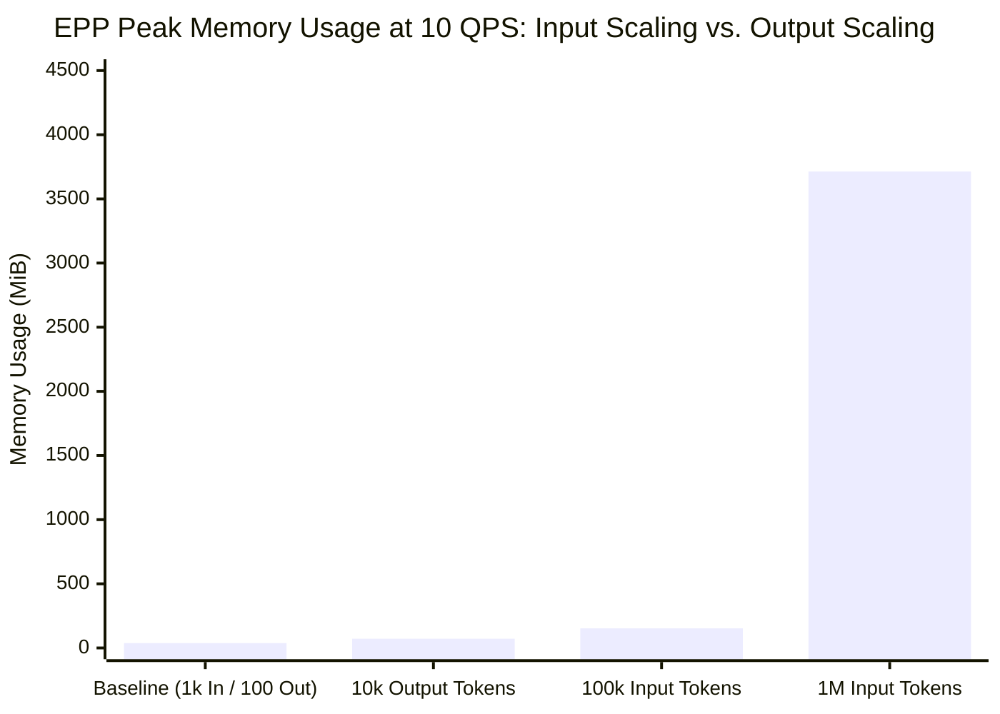
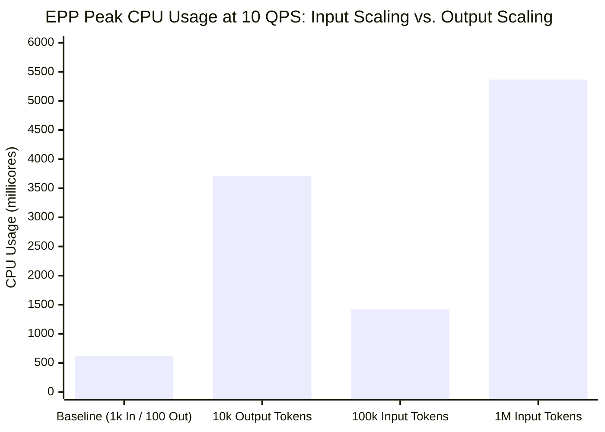

# Architectural Synthesis: Input Token Size vs. Output Token Size Impact on EPP Resources

This report compares the empirical scaling behavior and architectural root causes of **Input Token Size** vs. **Output Token Size** on Endpoint Picker (EPP) CPU and Memory consumption, based on benchmark sweeps conducted at a steady **10 QPS** request rate.

---

## Executive Summary: The Dominance Matrix

| Resource Dimension | Dominant Driver | Empirical Scaling Delta (at 10 QPS) | Architectural Mechanism |
|---|---|---|---|
| **EPP Memory (RAM)** | **Input Token Size** *(Overwhelmingly)* | • **Input (1k $\rightarrow$ 1M tokens):** $+3,675\text{ MiB}$ ($38\text{ MiB} \rightarrow 3,713\text{ MiB}$) • **Output (100 $\rightarrow$ 10k tokens):** $+34\text{ MiB}$ ($38\text{ MiB} \rightarrow 72\text{ MiB}$) | **Monolithic vs. Incremental Buffering:** Input prompts arrive as monolithic ~4 MB JSON payloads requiring AST deserialization, buffer copying, and radix tree indexing (~0.5 MiB RAM per 1k prefix tokens). Output tokens stream incrementally in ~500-byte chunks that are processed and immediately discarded without buffer accumulation. |
| **EPP Compute (CPU)** | **Input Token Size** *(At Extreme Contexts)*  **Output Token Size** *(Per-Token Efficiency)* | • **Input (1k $\rightarrow$ 1M tokens):** $+4.75\text{ cores}$ ($0.62 \rightarrow 5.37\text{ cores}$) • **Output (100 $\rightarrow$ 10k tokens):** $+3.11\text{ cores}$ ($0.60 \rightarrow 3.71\text{ cores}$) | **Deserialization/Indexing vs. Callback Frequency:** Input CPU is driven by JSON string parsing of ~40 MB/s traffic ($+3.15\text{ cores}$) and deep radix tree traversals ($+0.69\text{ cores}$). Output CPU is driven by high-frequency `ext_proc` gRPC stream callbacks (~100,000 chunk callbacks/sec at 10k output tokens / 10 QPS), where each callback invokes parser checks and TTL state refreshes (`Touch`). |

---

## 1. Memory (RAM): Why Input Tokens Dominatingly Explode Memory

### The Architectural Root Cause
1. **Monolithic Prompt Payload Buffering (~3.7 GiB at 1M Input Tokens):**
   - When an HTTP request arrives with a 1,000,000-token prompt, the JSON payload is a monolithic **~4 MB string**. At 10 QPS, EPP receives ~40 MB/s of incoming payload traffic.
   - The Go runtime must allocate contiguous memory buffers to read the payload, deserialize JSON fields into AST structures (`openai` parser), and subject those string copies to garbage collection tracking. This payload buffering accounts for **~88% of EPP memory usage** at 1M tokens.
2. **Prefix Tree Indexing Overhead (~500 MiB at 1M Input Tokens):**
   - In `optimized-baseline`, storing prefix radix tree nodes and KV cache utilization tables across 10 candidate pods consumes **~0.5 MiB of RAM per 1,000 indexed prefix tokens** (~500 MiB at 1M tokens).
3. **Why Output Tokens Consume Negligible Memory (~34 MiB Increase at 10k Output Tokens):**
   - Unlike prompt inputs, output responses are **never buffered monolithically** in EPP. 
   - When a target pod generates 10,000 output tokens, it streams them back over HTTP/2 in tiny SSE chunk frames (~500 bytes per chunk). EPP receives each chunk via an asynchronous `ext_proc` callback, refreshes internal TTL timers, and immediately releases the frame. Because chunks are transient and discarded continuously, memory consumption remains flat (**72 MiB at 10,000 output tokens**).

---

## 2. Compute (CPU): Two Distinct Computational Bottlenecks

### 1. Input Token CPU Costs: Deserialization & Radix Tree Matching
- **Monolithic JSON Deserialization ($+3.15\text{ cores}$ at 1M tokens):** Deserializing ~40 MB/s of 1M-token string payloads into Go AST structs costs 3.15 cores of CPU. Switching to `passthrough-parser` eliminates this cost, dropping 1M-token CPU from 5.37 cores to 2.22 cores.
- **Radix Tree Longest-Prefix Matching ($+0.69\text{ cores}$ at 1M tokens):** Traversing deep radix trees across 10 pods to evaluate longest-prefix matches adds 0.69 cores of CPU. Capping `maxPrefixTokensToMatch: 50` eliminates this traversal cost, recovering ~0.64 cores.

### 2. Output Token CPU Costs: High-Frequency gRPC Callback Volume
- **The `ext_proc` Callback Flood ($+3.11\text{ cores}$ at 10k output tokens):** When generating 10,000 output tokens across 10 QPS, Envoy sends an `ext_proc` gRPC call to EPP's `HandleResponseBody` for **every single streaming data chunk**.
- This results in approximately **~100,000 gRPC chunk callbacks per second** hitting EPP. On every single chunk callback, EPP executes parser checks (`openai` usage extraction) and invokes `PluginState.Touch` across registered plugins to reset request TTL timers.
- **The Passthrough Remedy ($+0.81\text{ cores saved}$):** Using `passthrough-parser` skips usage parsing checks across those 100,000 callbacks/sec, reducing EPP CPU from 3.71 cores down to **2.90 cores**.

---

## Summary & Engineering Recommendations

1. **For Memory Constrained Environments:** **Input Token Size** is the primary threat. To prevent OOM evictions under long-context traffic (>100k tokens), budget **~4.5 GiB RAM per 10 concurrent 1M-token requests**, use `passthrough-parser` to reclaim ~40% RAM, and cap `maxPrefixTokensToMatch` to bound radix tree growth. Output token length requires virtually no extra memory provisioning.
2. **For CPU Constrained Environments:** Both dimensions require careful CPU budgeting, but attack the system differently:
   - For **Long Input Traffic**, CPU is consumed by **payload parsing and tree matching**. Optimize by using `passthrough-parser` and capping prefix match depth.
   - For **Long Output Streaming Traffic**, CPU is consumed by **gRPC callback frequency (~100k callbacks/sec at 10k output tokens / 10 QPS)**. Optimize by switching to `passthrough-parser` to eliminate per-chunk JSON evaluation.
