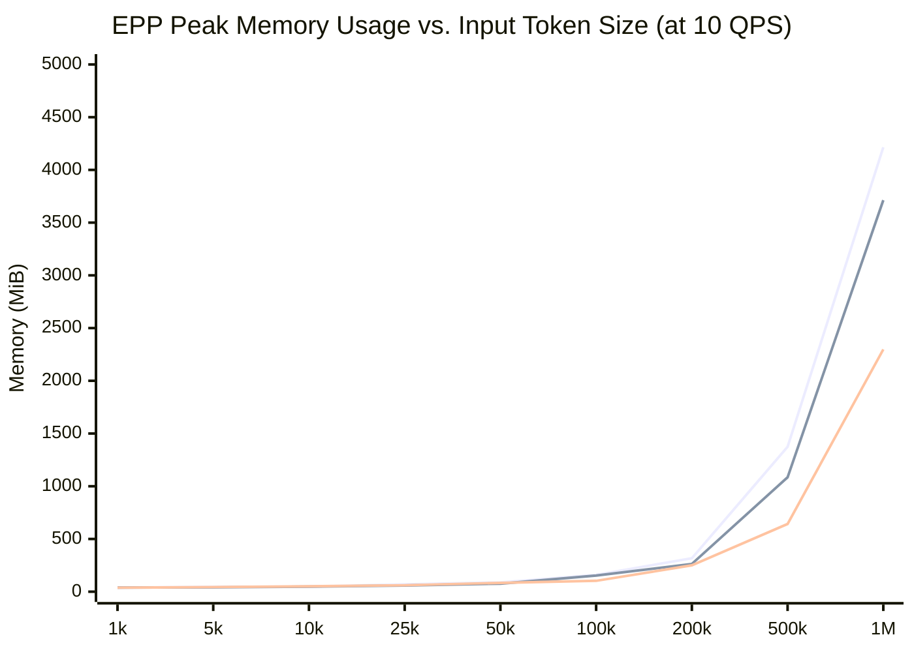

# Architectural Synthesis: How Token Size and QPS Impact Router CPU & Memory Usage

This document synthesizes findings across all benchmark sweeps (token sizes from 1k to 1M tokens; QPS rates from 10 to 500 req/s) to establish a comprehensive architectural model of resource consumption in `llm-d-router` and its Endpoint Picker (EPP).

---

## Executive Summary: The Resource Scaling Matrix

| Resource Dimension | Primary Driver | Dominant Scaling Axis | Key Behavioral Rule |
|---|---|---|---|
| **EPP Memory (RAM)** | Prompt Payload Size & Indexing | **Token Size** *(Linear)* | Scales linearly with prompt length (~3.7 GiB to 4.5 GiB at 1M tokens). Virtually unaffected by QPS for small token payloads (~35–48 MiB at 500 QPS). |
| **EPP Compute (CPU)** | Request Volume & Algorithm Depth | **Both** *(Multiplicative)* | Driven by QPS at small token sizes (~3.0 to 4.9 cores at 500 QPS), and driven by payload deserialization + tree matching depth at large token sizes (~5.4 to 7.1 cores at 1M tokens / 10 QPS). |
| **Envoy Proxy Resources** | Network I/O Throughput (MB/s) | **Both** *(Proportional)* | Scales with total data volume transferred (QPS $\times$ Payload Bytes). Consumes ~1.2 to 2.0 cores of CPU when streaming high data rates (40–100 MB/s). |

---

## 1. The Impact of Input Token Size (at Constant 10 QPS)

When scaling input token size from **1,000 to 1,000,000 tokens** at a steady 10 QPS, each request body expands from ~4 KB to **~4 MB of text** (total network throughput: ~40 MB/s).

*(Line 1 (Top): `optimized-baseline`, Line 2 (Middle): `random-default-parsers`, Line 3 (Bottom): `random-passthrough`)*

### Memory Dynamics: Governed by Buffering & Index Trees
- **The Runtime Buffering Baseline (~3.7 GiB at 1M Tokens):** In `random-only` (with default parsers and zero caching plugins), memory reaches **3,713 MiB**. This proves that buffering, deserializing JSON string fields, and garbage collecting 10 concurrent 1M-token requests (~40 MB in flight) accounts for **~88% of EPP memory consumption** at long context lengths.
- **The Prefix Indexing Overhead (~500 MiB at 1M Tokens):** In `optimized-baseline`, memory reaches **4,215 MiB**. The difference (**~502 MiB**) represents the exact RAM required to store prefix radix tree nodes and KV cache utilization tables across 10 candidate pods (**~0.5 MiB of RAM per 1,000 indexed prefix tokens**).
- **The Passthrough Advantage (~1.4 GiB Saved):** Using `passthrough-parser` drops memory to **2,298 MiB**, cutting RAM usage by **38.1%** by bypassing AST struct creation and string copying in the Go runtime.

### CPU Dynamics: Governed by Deserialization & Tree Lookups
- For prompts under **25,000 tokens**, EPP CPU remains modest (**~0.9 to 1.5 cores**).
- At **1,000,000 tokens**, CPU usage accelerates non-linearly:
  - `random-passthrough` requires **2.22 cores** (pure IPC and raw network byte streaming).
  - `random-only` requires **5.37 cores** (+3.15 cores for JSON string parsing of 40 MB/s).
  - `active-request-only` requires **6.43 cores** (+1.06 cores for pod metrics polling and scoring).
  - `optimized-baseline` requires **7.12 cores** (+0.69 cores for deep radix tree longest-prefix matching).
  - *Proof by Capping:* Setting `maxPrefixTokensToMatch: 50` drops CPU from 7.12 cores down to **6.48 cores** (converging with `active-request`), confirming that tree traversals beyond 50 tokens cost **~0.64 cores** at 1M tokens.

---

## 2. The Impact of Request Rate (QPS) (at Constant 200 Input Tokens)

When scaling throughput from **10 to 500 QPS** with small token payloads (`input=200`, `output=100`), each request is a tiny ~1 KB JSON payload, but request volume increases 50-fold.

```mermaid
xychart-beta
    title "EPP Peak CPU Usage vs. Request Rate (200 Input Tokens)"
    x-axis [10 QPS, 100 QPS, 200 QPS, 500 QPS]
    y-axis "EPP CPU (millicores)" 0 --> 6000
    bar [620, 1202, 1813, 3621]
    bar [603, 1100, 1498, 3049]
    bar [443, 1300, 2395, 4937]
```

*(Bar 1: `random-default-parsers`, Bar 2: `random-passthrough`, Bar 3: `optimized-baseline`)*

### CPU Dynamics: Perfectly Linear with Throughput
- **Per-Request JSON Parsing Cost:** At 500 QPS, `random-passthrough` consumes **3.05 cores** (~6.1m CPU per req/s), while `random-default-parsers` consumes **3.62 cores** (~7.2m CPU per req/s). The delta (**0.57 cores**) demonstrates that deserializing 500 JSON request bodies per second costs ~0.57 cores in Go (**~1.14m CPU per QPS**).
- **Per-Request Multi-Plugin Scoring Cost:** At 500 QPS, `optimized-baseline` consumes **4.94 cores** (~9.9m CPU per req/s). Executing 500 scoring passes, candidate filtering loops, and prefix tree lookups across 10 pods adds **1.89 cores of compute overhead** over random picking.
- **Latency Tail Spikes Under High Concurrency:** When EPP compute demand reaches ~5.0 cores at 500 QPS, lock contention and candidate evaluation queues in `optimized-baseline` cause P95 latency to jump to **78.55 ms** (P50 = 3.59 ms). Conversely, random picking configurations maintain sub-millisecond P50 (~0.69 ms) and under ~4.5 ms P95 at 500 QPS.

### Memory Dynamics: Decoupled from Throughput
- Because 200-token payloads are ~1 KB each, buffering 500 concurrent requests only requires ~500 KB of active string data.
- Consequently, EPP peak memory remains virtually flat across all QPS rates, staying between **35 MiB and 48 MiB** from 10 QPS up to 500 QPS.

---

## 3. Synthesis & Engineering Recommendations

1. **For Large Prompt Workloads (>100k Tokens):**
   - **Memory Provisioning:** Budget at least **~4.5 GiB RAM per 10 concurrent 1M-token requests** for standard parsers, or use `passthrough-parser` to reduce RAM demand by ~40% (if prompt-based routing is not required).
   - **Prefix Matching Depth:** If full 1M-token prefix matching consumes excessive CPU, cap `maxPrefixTokensToMatch` (e.g., `50` to `500` tokens). Matching short headers/system prompts provides high routing affinity while recovering **~0.64 cores of CPU** per 10 QPS.
2. **For High-Throughput Small Prompt Workloads (>200 QPS):**
   - **CPU Provisioning:** Scale EPP CPU linearly with QPS, budgeting **~7.2m CPU per QPS** for basic routing and **~10m CPU per QPS** for full multi-plugin scoring.
   - **Parser Optimization:** Switch to `passthrough-parser` when using non-content-based routing (load/queue/random scoring) to instantly reclaim **~16% of total EPP CPU** at 500 QPS.
